# S&S Care

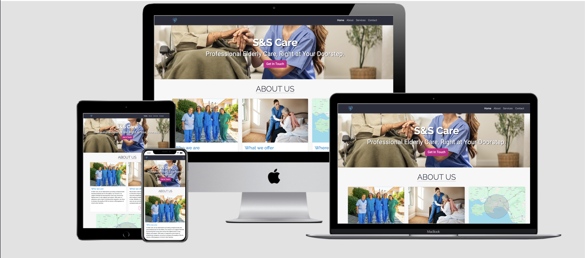

## Site Overview

This project is a responsive website for S&S Care, a private care company based in South Wales. S&S Care specialises in care for the elderly and individuals with dementia and Alzheimer's.

The site is designed to be user-friendly and accessible, helping families easily find the information they need about the services offered. It provides clear navigation, a simple layout, and an easy-to-use contact form. The site is designed with a minimal but professional aesthetic, focusing on simplicity and accessibility to provide a positive user experience.

[View Live Site.](https://alexthoma5.github.io/S-and-S-care-mp1/index.html) Hosted on GitHub Pages.

## Table Of Contents:

1. [Design & Planning](#design-&-planning)
   - [User Stories](#user-stories)
   - [Wireframes](#wireframes)
   - [Typography](#typography)
   - [Colour Scheme](#colour-scheme)
2. [Features](#features)
   - [Site Wide Features](#Site-wide-features)
   - [Home Page](#Home-page)
   - [Services Page](#Services-page)
   - [Contact Page](#Contact-page)
   - [Success Page](#Success-page)
3. [Technologies Used](#technologies-used)
4. [Testing](#testing)
5. [Bugs](#bugs)
6. [Deployment](#deployment)
7. [Credits](#credits)

## Design & Planning:

### User Stories

1. As an elderly person, I want to be able to easily find information about the types of care services provided, so I can understand if the company meets my needs.
2. As a new site user, I need easy navigation and a user-friendly design, including a responsive layout for my device, so I can find information quickly and efficiently without frustration.
3. As an elderly client, I want a straightforward way to request a callback from the care team, so I can ask questions or get more information at a convenient time.
4. As an elderly person, I want to easily find contact information like phone numbers and email addresses, so I can quickly reach out for assistance when needed.
5. As a family member, I want to see pictures of the caregivers in action, so I can visualise the care environment and interactions.
6. As a family member, I want to be able to see testimonials from other families so that I trust the care provided for my loved one.
7. As a new customer, I want to know what locations these services are offered in, so I don’t waste time enquiring if it’s not in my area.
8. As an elderly client, I want to see what kinds of social activities or companionship services are available, so I can stay engaged and avoid feeling lonely.

### Wireframes

The wireframes for this website were created using Balsamiq to establish a clear and intuitive structure. I followed the mobile-first approach ensuring my site is optimised and responsive across all devices.

1. #### Home Page:

    <details><summary>Click to view wireframes</em></summary>

    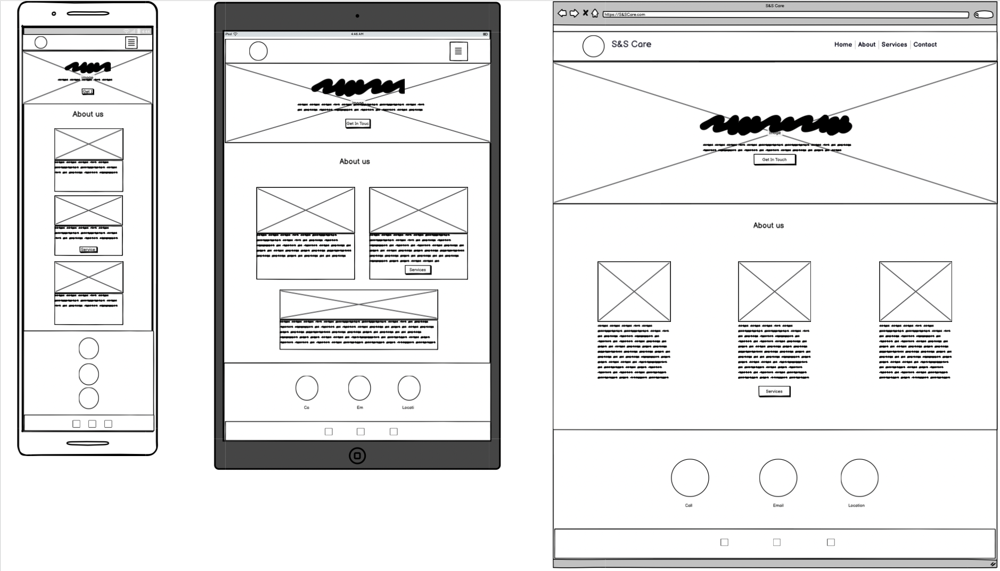

    </details>

2. #### Services Page:

    <details><summary>Click to view wireframes</em></summary>

    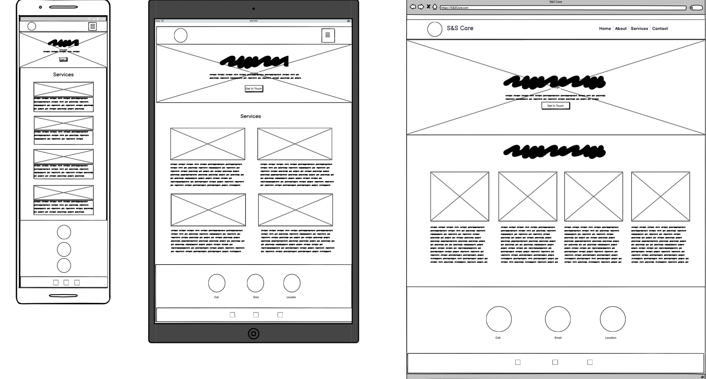

    </details>

3. #### Contact Page:

    <details><summary>Click to view wireframes</em></summary>

    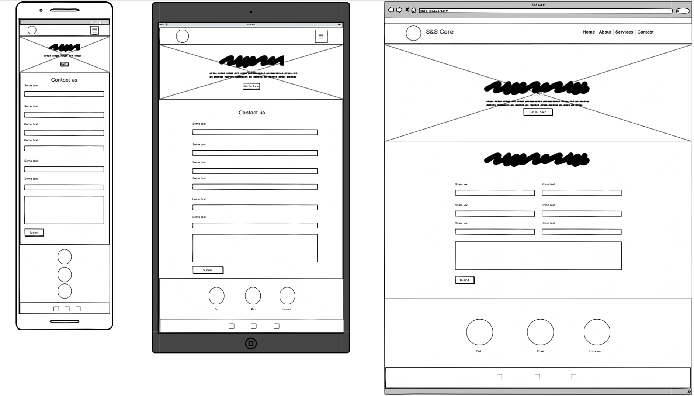

    </details>

4. #### Success Page:

    <details><summary>Click to view wireframes</em></summary>

    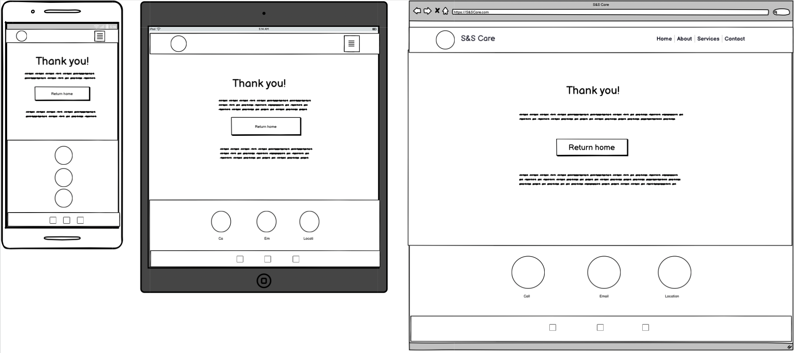

    </details>

5. #### 404 Error Page:

    <details><summary>Click to view wireframes</em></summary>

    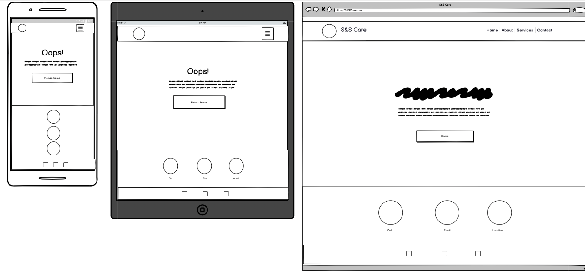

    </details>

### Typography

When selecting the fonts for my website, I considered readability, aesthetics and brand identity. Therefore I chose the following fonts:

#### Primary Font - Roboto

  - Used for all text, besides headings.
  - Clean, modern, and highly legible, especially good for mobile views.


  #### Secondary Font - Raleway

  - Used for all headings across the site.
  - Modern, simple and highly readable.

### Colour Scheme

When deciding on a colour scheme, I wanted to continue the modern, professional and highly readable guidelines I previously set for myself. In doing so these are the colours I decided upon.

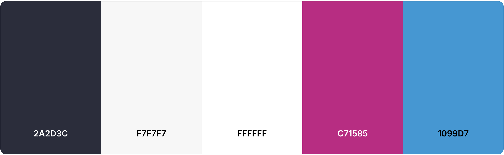

I chose the colour "Raisin Black" as my primary colour. I thought it provided a professional look while complimenting the colours of the company logo in the navigation bar.

The background color of my website is "Seasalt". This neutral colour contrasts very well with the primary colour and helps the white space around the text stand out more. For a clean, uncluttered look.

The main highlight colour "Celestial Blue" is used for many subheadings across the site. This helps the headings be clear and visible to the user. This shade of blue is similar to uniforms worn by caregivers and the colours of the S&S Care logo. This helps create a feeling of familiarity for the user as they navigate the website.

The final highlight colour is "Red Violet". This is used on all call-to-action buttons across the site. This vibrant colour stands out very well amongst the other colours of the site, directing the user's attention to the most important features of the site.

## Features:

### Site Wide Features:

#### Navigation

The website uses Bootstrap's fully responsive navbar component. This ensures the navbar adjusts seamlessly across all screen sizes, from desktop to mobile. The navbar has been fully customised using a custom logo, a clean and modern font and my primary colour "Raisin Black". The custom logo also links directly to the home page, this is common practice in the industry and provides a sense of familiarity to the user.

*Full sized navigation bar:*


- Contains links to Home page, About us section, Services page and Contact page.
- This allows users to easily navigate between pages and access the information they desire.

*Collapsed Navbar:*

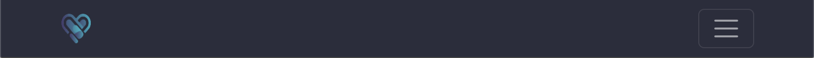
- Contains a collapsible menu for smaller screens, enhancing usability on mobile devices.
- Clean design that helps keep the screen uncluttered, enabling a better user experience.

#### Contact-info Section

The website features a small section on each page dediacted to contact information.

- Call us card is interactive, clicking on it will open up the phone application. Allowing the user to easily contact the company, with a simple click of the button.
- Email us card is also interactive, clicking on it will open up an email window for the user to email us directly.

*Contact Information section on large screens*

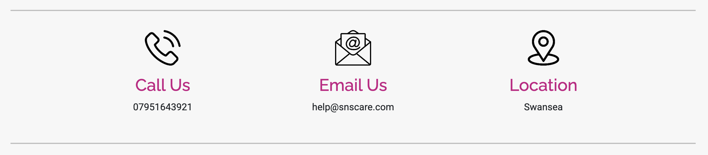
- The Contact Information section is arranged in a row, sitting at the bottom of each page above the footer.

*Contact Information section on mobile devices*

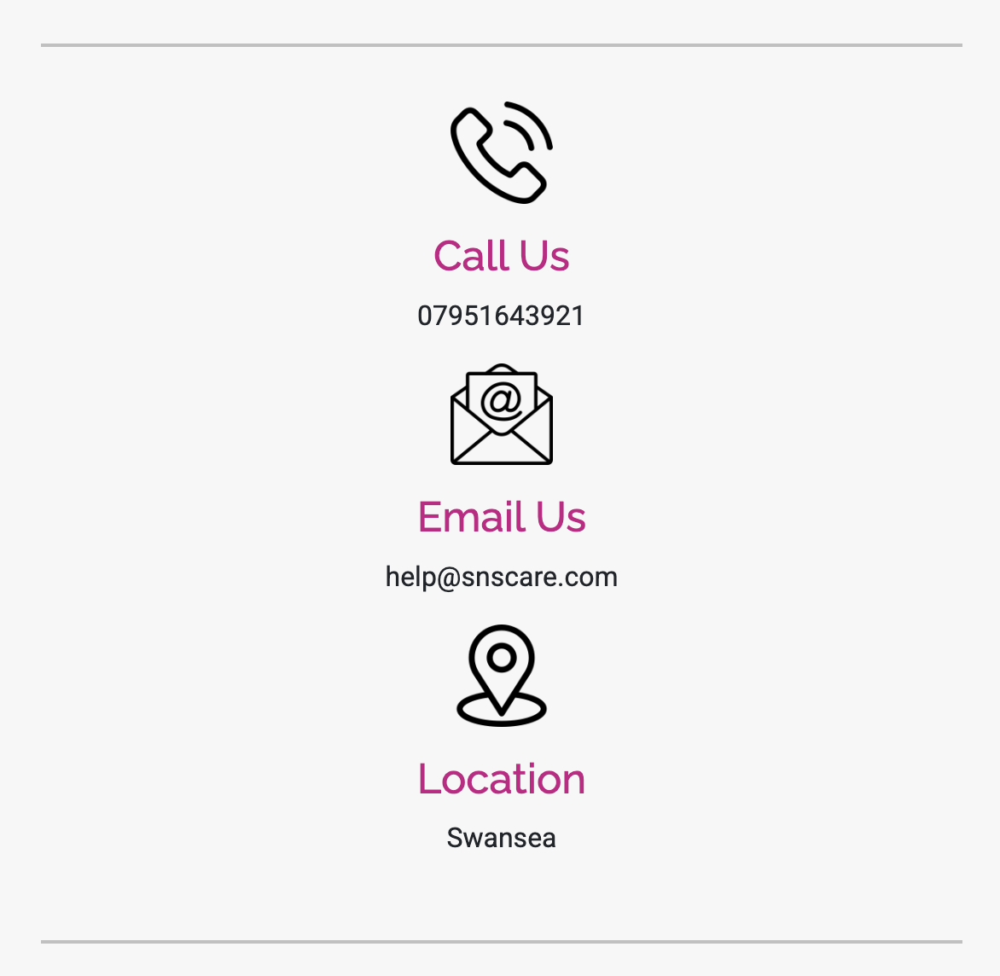
- The Contact Information section collapses down into a column to give each icon more room and keep the layout clean.

#### Footer

I have chosen to go with a basic responsive footer that provides links to social media pages that open in new tabs. This will allow the user to easily locate our other social platforms where they can interact with the business further. 

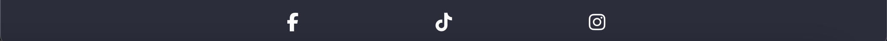
- Contains social media links that open in a new tab. Icons are also accessible to visually impaired users using a screen reader, by the use of aria labels. 
- Styled to match the header to keep the website aesthetic professional 

#### Favicon

The website has a site wide favicon with the S&S Care logo. This provides an image in the browser tabs header to allow the user to easily identify the website if they have multiple tabs open.

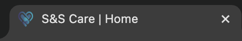

#### 404 Page

A 404 page is implemented into the website and will display if the user navigates a broken link.
- The 404 page features an error message which lets the user know that they have navigated to a broken link.
- The 404 page features a redirect button which returns the user to the home page. 

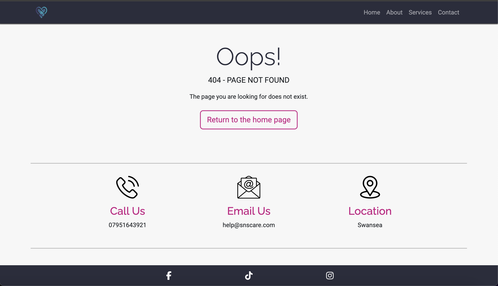

### Home Page

#### Hero Header

The home page features a hero image header, this helps to show the user what the website is about immediately and provides a visually appealing background to the header.

- The S&S Care heading is inside the header with a short sentence summarising their work. This helps the user instantly recognise the type of website they are on while also promoting the company's qualities.
- The header features the call to action (CTA) button, which provides the user with a direct route to the contact page. The (CTA) button is also highlighted in "VioletRed", this draws the attention of the user as it stands out. 

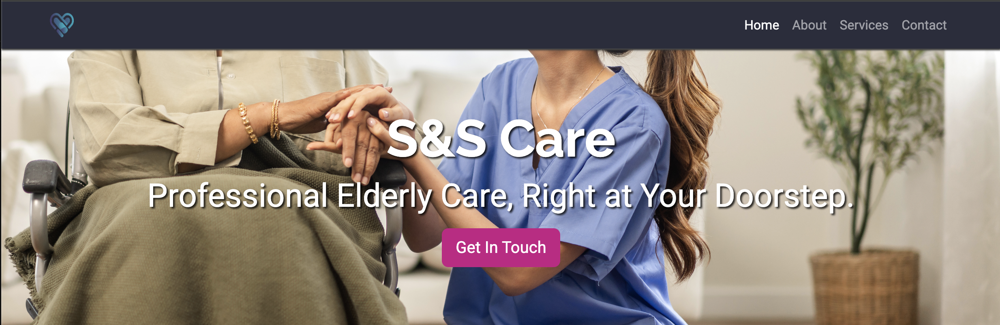

#### About Us Section

The About Us section within the homepage is there to provide the user with a summary of 'Who we are, what we offer and where we operate'. This breaks down the information into readable chunks for the user, while still providing valuable information. 

- Three cards providing the essential who, what and where of the business
- A call to action button on the services card, that directs the user to the services page if they want a more in-depth look at the services provided.

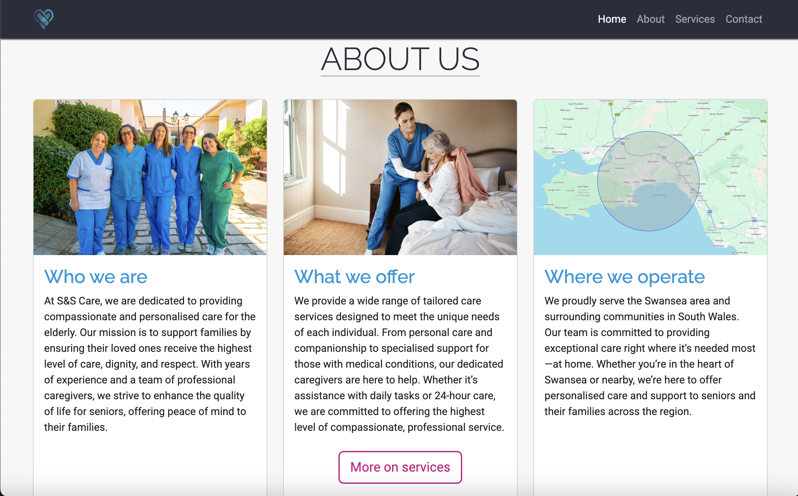

### Services Page

The services page also features a header hero image, this is done to keep consistency across the website and provide different visually appealing images.

- The header features the call to action (CTA) button, which provides the user with a direct route to the contact page. The (CTA) button is also highlighted in "VioletRed", this draws the attention of the user as it stands out. 

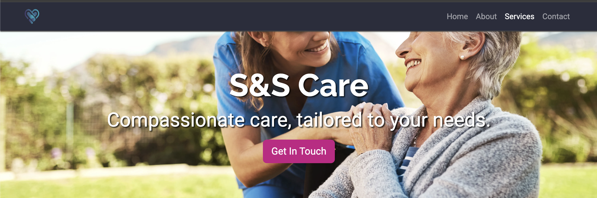

#### Services Page Header

#### Services section

The main section of the services page features responsive cards that show the user the four main services the company provides.

- Each service card has a visually appealing image that gives the user a visual example of the service, leaving the user with a positive experience.
- Each service card has four bullet points that offer examples of each service, so the user has an easier task of seeing whether we provide the service that they want.

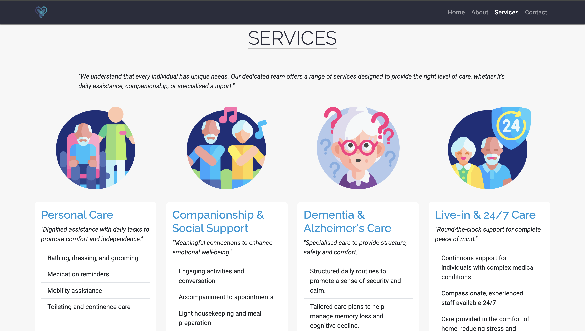

### Contact Page

The contact page features a contact form that will allow users to contact S&S Care to enquire about the care services.

- The correct form validation is used preventing users from submitting it without the valid information.
- Upon successful submission the user will be directed to success.html displaying a success message.

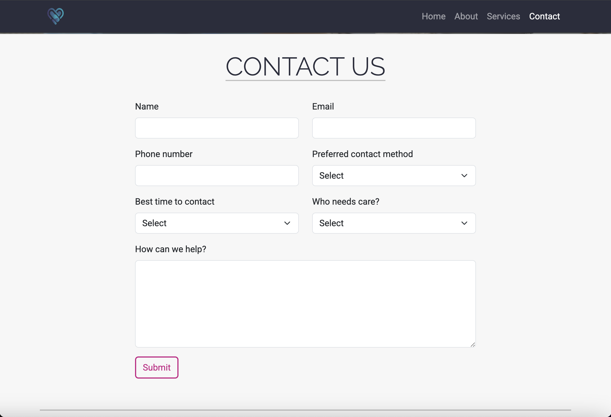

### Success Page

The success page is reached upon a successful completion of the contact form, this gives the user positive feedback and prevents users from submitting multiple forms.

- The success message provided thanks the user and tells them of their successful submission.
- A redirect button is also provided so the user can easily navigate back to the homepage.

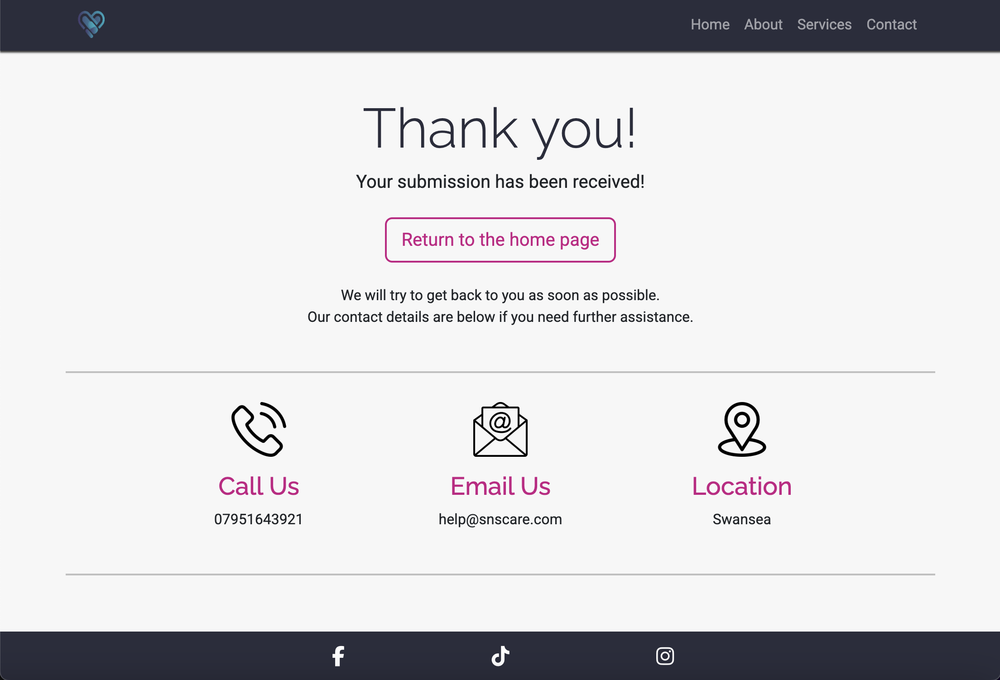

## Technologies Used

* HTML
    * The structure of the Website was developed using HTML as the main language.
* CSS
    * The Website was styled using custom CSS in an external file.
* Visual Studio Code
    * The website was developed using Visual Studio Code IDE
* GitHub
    * Source code is hosted on GitHub and delpoyed using Git Pages.
* Git 
    * Used to commit and push code during the development phase of the Website
* Font Awesome
    * Icons obtained from https://fontawesome.com/ were used as the Social media links in the footer section. 
* Tinyjpg
    * https://tinyjpg.com/ was used to reduce the size of the images used throughout the website
* Favicon.io
    * favicon files were created at https://favicon.io/favicon-converter/ 
* balsamiq
    * wireframes were created using balsamiq from https://balsamiq.com/wireframes/desktop/#

## Testing

Important part of your README!!!

### Google's Lighthouse Performance

Screenshots of certain pages and scores (mobile and desktop)

### Browser Compatibility

Check compatability with different browsers

### Responsiveness

Screenshots of the responsivness, pick few devices (from 320px top 1200px)

### Code Validation

Validate your code HTML, CSS (all pages/files need to be validated!!!), display screenshots

### Manual Testing user stories or/and features

Test all your user stories, you an create table
User Story | Test | Pass
--- | --- | :---:
paste here you user story | what is visible to the user and what action they should perform | &check;

- and attach screenshot

## Bugs

List of bugs and how did you fix them

## Deployment

### Version Control

The site was created using the Visual Studio code editor and pushed to github to the remote repository ‘S-and-S-care-mp1’.

The following git commands were used throughout development to push code to the remote repo:

```git add .``` - This command was used to add the file(s) to the staging area before they are committed.

```git commit -m “commit message”``` - This command was used to commit changes to the local repository queue ready for the final step.

```git push``` - This command was used to push all committed code to the remote repository on github.

### Deployment to Github Pages

- The site was deployed to GitHub pages. The steps to deploy are as follows: 
  - In the GitHub repository, navigate to the Settings tab 
  - From the menu on left select 'Pages'
  - From the source section drop-down menu, select the Branch: main
  - Click 'Save'
  - A live link will be displayed in a green banner when published successfully. 

The live link can be found here - https://alexthoma5.github.io/S-and-S-care-mp1/index.html

### Clone the Repository Code Locally

Navigate to the GitHub Repository you want to clone to use locally:

- Click on the code drop down button
- Click on HTTPS
- Copy the repository link to the clipboard
- Open your IDE of choice (git must be installed for the next steps)
- Type git clone copied-git-url into the IDE terminal

The project will now of been cloned on your local machine for use.

## Credits

List of used resources for your website (text, images, snippets of code, projects....)

- Code & Text Content

- Media

- Acknowledgment
  - acknowledgment to mentors, peers, tutors, friends, family, facilitator (who ever contributed and helped with the project)
